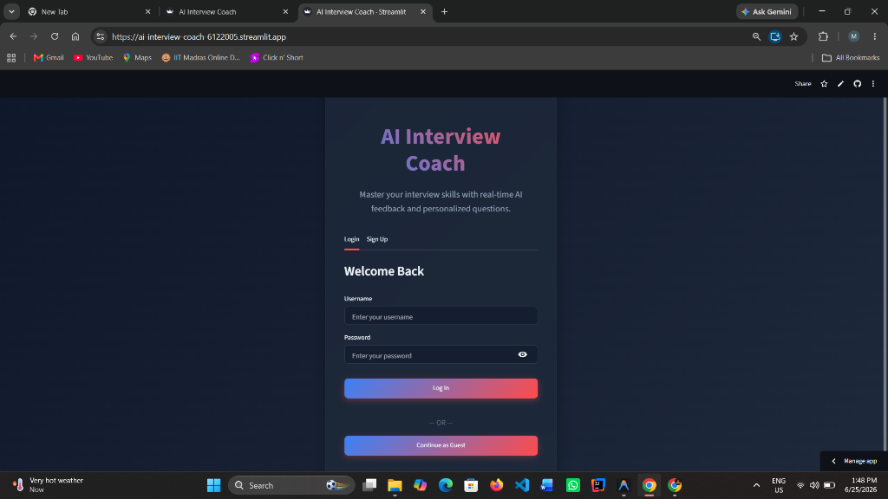
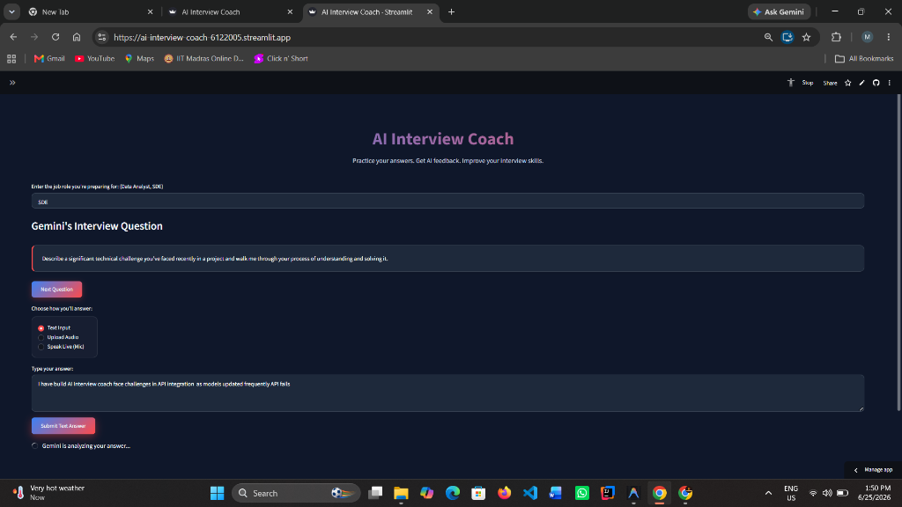
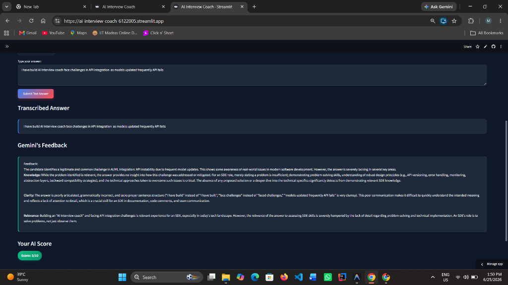

# 🎓 AI Interview Coach

> AI-powered interview practice platform with role-specific questions, multi-modal answer input, real-time Gemini feedback, and secure user authentication.

🔗 **Live Demo:** [ai-interview-coach-6122005.streamlit.app](https://ai-interview-coach-6122005.streamlit.app/)

---

## 📌 Overview

AI Interview Coach helps job seekers practice interviews for any role — SDE, Data Analyst, Product Manager, and more. Users get AI-generated questions, answer via text, uploaded audio, or live microphone, and receive instant structured feedback with a score out of 10.

Built as a solo project during an AI internship. Idea, architecture, and core logic are original.

---

## 📸 Screenshots

| Login Page | Interview Screen | AI Feedback |
|---|---|---|
|  |  |  |

---

## ✨ Features

- 🔐 **Secure Authentication** — bcrypt-hashed passwords (min. 8 chars) stored in SQLite; login, signup, guest mode, and session logout
- 💬 **Role-Specific Questions** — Gemini 2.5 Flash generates tailored interview questions based on the target job role
- ✍️ **Text Answer Mode** — Type your response and get instant AI evaluation
- 🎙️ **Audio Upload Mode** — Upload an MP3/WAV/M4A file; Whisper transcribes it, Gemini evaluates it
- 🎤 **Live Mic Mode** — Speak directly; real-time transcription via SpeechRecognition
- 📊 **AI Scoring** — Structured feedback on knowledge, clarity, and relevance with a score out of 10
- ⚠️ **Graceful Error Handling** — API failures surface user-friendly messages, never raw stack traces

---

## 🛠️ Tech Stack

| Layer | Technology |
|---|---|
| Frontend / App | Streamlit |
| AI / LLM | Google Gemini 2.5 Flash (`google-genai`) |
| Speech-to-Text | OpenAI Whisper + SpeechRecognition |
| Audio Processing | pydub |
| Database | SQLite (`sqlite3`) |
| Auth | bcrypt |
| Config | python-dotenv |
| Deployment | Streamlit Cloud |

---

## 🏗️ Architecture

```
┌─────────────────────────────────────────┐
│              Streamlit Frontend          │
│   Login / Signup / Guest  ──▶  App UI   │
└────────────┬────────────────────────────┘
             │
     ┌───────▼────────┐
     │   login.py      │  bcrypt auth + SQLite users table
     └───────┬─────────┘
             │
     ┌───────▼────────┐
     │   app.py        │  Session state + answer routing
     └──┬────┬─────┬──┘
        │    │     │
   Text │  Audio  Mic
        │    │     │
        │  whisper_transcriber.py
        │  mic_input.py
        │    │     │
     ┌──▼────▼─────▼──┐
     │  gemini_module  │  Gemini 2.5 Flash + prompt engineering
     └────────────────┘
```

---

## 📂 Project Structure

```
├── app.py                    # Main Streamlit app, UI logic, session management
├── login.py                  # Auth: bcrypt hashing + SQLite signup/login/validation
├── gemini_module.py          # Gemini API client, question generation, feedback + scoring
├── whisper_transcriber.py    # Audio file → text transcription (Whisper)
├── mic_input.py              # Live mic → text (SpeechRecognition)
├── screenshots/              # UI screenshots
├── requirements.txt
├── .env                      # (not committed) API keys
└── .gitignore
```

---

## 🚀 Local Setup

**1. Clone the repo**
```bash
git clone https://github.com/md-abidhussain/AI-Interview-Coach.git
cd AI-Interview-Coach
```

**2. Install dependencies**
```bash
pip install -r requirements.txt
```

**3. Add your API key**

Create a `.env` file:
```
GEMINI_API_KEY=your_gemini_api_key_here
```

**4. Run the app**
```bash
streamlit run app.py
```

---

## 🔐 Security Design

- Passwords hashed with `bcrypt.hashpw()` on signup — never stored in plain text
- Minimum 8-character password enforced on signup
- Username validated with regex — alphanumeric + underscore, 3–20 chars only
- `bcrypt.checkpw()` used for login — original password is never recoverable or stored
- API key loaded from `.env` → Streamlit Secrets → raises a clear error if missing
- `.env` and `users.db` excluded from version control via `.gitignore`

---

## 🔮 Future Improvements

- Session history — store past questions and scores per user in a second SQLite table
- Performance dashboard — visualize improvement over time
- Difficulty levels — beginner, intermediate, senior for each role
- Export session as PDF report

---

## 👨💻 Author

**Mohd Abid Hussain** — CSE @ Jamia Hamdard
[LinkedIn](https://www.linkedin.com/in/md-abidhussain) · [GitHub](https://github.com/md-abidhussain)

---

*Built with Python, Streamlit, and Google Gemini API*
